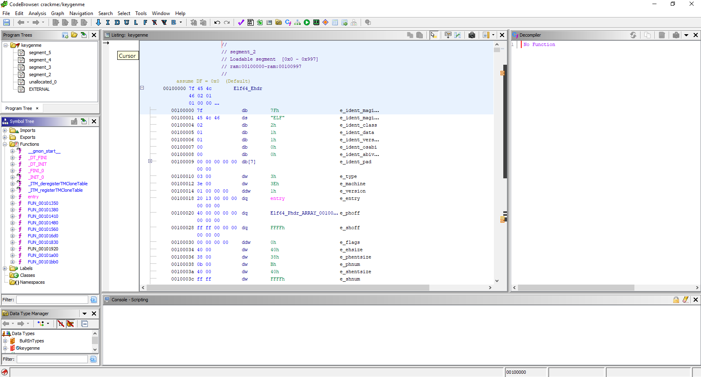
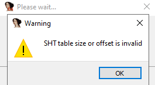
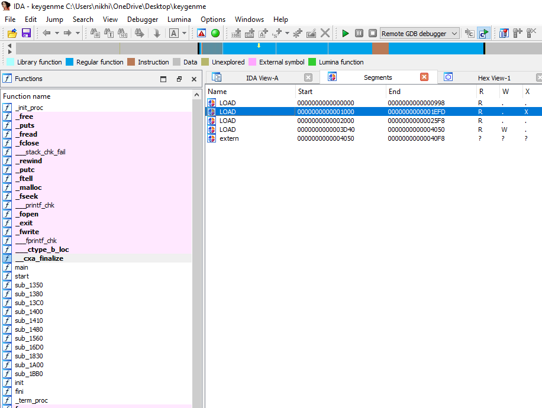
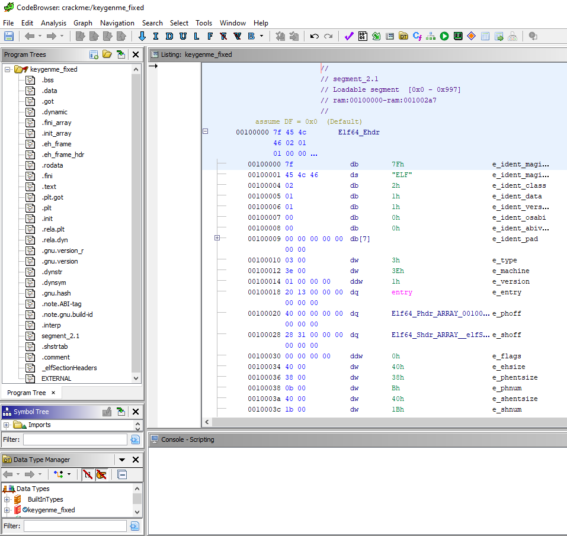
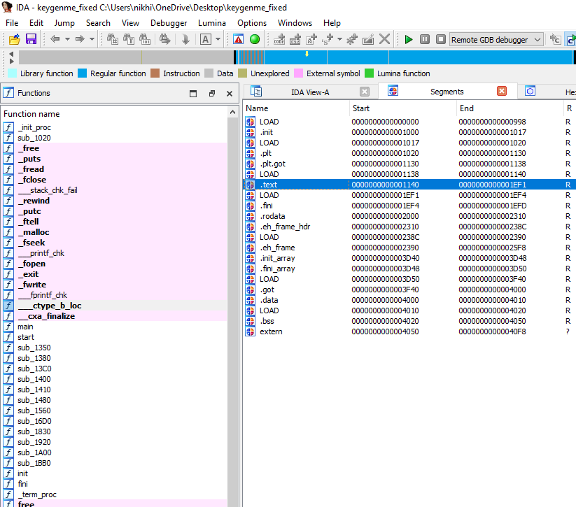

# Overview

ELFLepton is a Lightweight ELF Parsing Tool that was designed specifically for analyzing, editing and fixing binaries with damaged or corrupted ELF headers, such as:

 - binaries that have had the ELF header deliberately mangled as an anti-analysis method (crackmes or malware)

Development was prompted by the failure of other tools (like `readelf`, `pyelftools`) to parse ELF binaries with manipulated ELF headers. For example, here's `pyelftools` (https://github.com/eliben/pyelftools) throwing an exception while trying to load a crackme:

```python
In [1]: from elftools.elf.elffile import ELFFile

In [2]: sample_path = "test_binaries/keygenme"

In [3]: with open(sample_path, "rb") as f:
   ...:     data = ELFFile(f)
   ...: 
---------------------------------------------------------------------------
FieldError                                Traceback (most recent call last)
...
...
ELFParseError: expected 4, found 0
```

When using Lepton to parse ELF binaries, one has access to every field in the ELF header, every entry of the program headers table and section headers table. Individual fields can be straightforwardly modified to repair corruption. Lepton succeeds in cases where other parsers because:

Like the system ELF loader, `elflepton` only relies on the value of the `e_machine` field in the ELF header and the ELF magic `\x7fELF` at offset 0 of the binary. All other values are either derived from `e_machine` value or algorithmically calculated. If the binary can be executed, it is also expected to be parsed correctly by `elflepton`, regardless of the extent of the corruption in the ELF header.

**Currently, only `x86` and `x86-64` binaries are supported.**

# Usage

Example use cases:

### Fixing Corrupted ELF Header Fields

One anti-analysis trick involving corrupting the ELF header is writing incorrect values to fields having to do with section information. Some tools will subsequently fail to parse or load the binary. A concrete example of this is a ["keygenme" crackme from crackmes.one](https://crackmes.one/crackme/5d7c66d833c5d46f00e2c45b) that Ghidra v10.1.3 and IDA Home v7.7 load but fail to derive useful section information. The crackme file `keygenme` is included with this repository, in the `test_binaries` folder.

For example, section names are not available when the binary is loaded into Ghidra v10.1.3. As can be seen, they're parsed as `segment_2`, `segment_3`, etc.



In IDA Home v7.7, it's the same story:





Using `readelf` it can be seen that the `Start of section headers` (`e_shoff`), `Size of section headers` (`e_shentsize`) and the `Section header string table index` (`e_shstrndx`) all hold bogus values:

```shell
$ readelf -h keygenme
ELF Header:
  Magic:   7f 45 4c 46 02 01 01 00 00 00 00 00 00 00 00 00 
  Class:                             ELF64
  Data:                              2's complement, little endian
  Version:                           1 (current)
  OS/ABI:                            UNIX - System V
  ABI Version:                       0
  Type:                              DYN (Position-Independent Executable file)
  Machine:                           Advanced Micro Devices X86-64
  Version:                           0x1
  Entry point address:               0x1320
  Start of program headers:          64 (bytes into file)
  Start of section headers:          65535 (bytes into file)
  Flags:                             0x0
  Size of this header:               64 (bytes)
  Size of program headers:           56 (bytes)
  Number of program headers:         11
  Size of section headers:           64 (bytes)
  Number of section headers:         65535
  Section header string table index: 65535 <corrupt: out of range>
readelf: Error: Reading 4194240 bytes extends past end of file for section headers
```

These values can be fixed using `elflepton` such that all the above tools can successfully load and parse the binary. The following code snippet does the trick. Note the usage of `new_header=True`. This is required to reconstruct the ELF header and section headers table. Without `new_header=True`, headers are basically cloned.

```python
from elflepton.lepton import ELFFile

sample_path = "test_binaries/keygenme"

with open(sample_path, "rb") as f:
    data = ELFFile(f, new_header=True)

new_data = data.reconstruct_file()

with open(sample_path + "_fixed", "wb") as f:
    f.write(new_data)
```

Ghidra now successfully imports the binary and displays section names:



IDA also successfully imports the binary and displays section names:



It can be seen with `readelf` that the ELF headers are now fixed:

```
$ readelf -h keygenme_fixed
ELF Header:
  Magic:   7f 45 4c 46 02 01 01 00 00 00 00 00 00 00 00 00 
  Class:                             ELF64
  Data:                              2's complement, little endian
  Version:                           1 (current)
  OS/ABI:                            UNIX - System V
  ABI Version:                       0
  Type:                              DYN (Position-Independent Executable file)
  Machine:                           Advanced Micro Devices X86-64
  Version:                           0x1
  Entry point address:               0x1320
  Start of program headers:          64 (bytes into file)
  Start of section headers:          12584 (bytes into file)
  Flags:                             0x0
  Size of this header:               64 (bytes)
  Size of program headers:           56 (bytes)
  Number of program headers:         11
  Size of section headers:           64 (bytes)
  Number of section headers:         27
  Section header string table index: 26
```

# Test Binaries

- Crackme https://crackmes.one/crackme/5d7c66d833c5d46f00e2c45b: `test_binaries/keygenme`

# TODO

- Handle the case where ELF header and program header overlap
